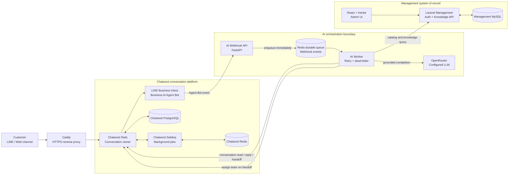

# AI Bot Chatwoot Architecture

## Scope

Version 1 serves one business. Laravel Management is the system of record for business
knowledge and catalog data. Chatwoot is the system of record for conversations, inboxes, and
human ownership. The Python service orchestrates AI replies and never connects directly to a
Management database.

## Runtime architecture

## Message lifecycle

1. A customer message arrives through a Chatwoot inbox.
2. Chatwoot sends the Agent Bot event to the internal AI webhook using the secret path token.
3. The webhook validates the token, writes the event to Redis, and returns `202 Accepted`.
4. The AI Worker consumes the event, retries transient failures up to three times, and moves
   exhausted events to a dead-letter queue.
5. The worker reads approved catalog/knowledge records -- and, for identity/greeting/business-meta
   questions, the cached Business Profile singleton -- from Laravel and sends grounded replies
   through the Chatwoot API.
6. Requests for a person, a payment/refund problem, or other handoff conditions change the
   conversation to human mode, assign it to the shared handoff team, and apply the `คนดูแลอยู่`
   Chatwoot label so staff can see the state without opening custom attributes.
7. Chatwoot also delivers `conversation_updated` events (label/status/assignment changes) to the
   same webhook. Staff apply the `ส่งกลับ-ai` label to explicitly hand a conversation back to the
   AI; the worker refetches live state, clears both labels, unassigns the human agent, and resets
   `ai_mode` to `ai`.

## Ownership and security boundaries

| Concern | Owner | Boundary |
|---|---|---|
| Conversation history and inbox state | Chatwoot | Rails API and PostgreSQL |
| Business catalog and knowledge | Laravel Management | Authenticated read API and MySQL |
| AI orchestration and retries | Python AI service | FastAPI, Redis queue, worker |
| Model completion | OpenRouter | Outbound HTTPS from AI service |
| Human handoff | Chatwoot team | Team assignment; no individual agent binding |

Secrets are supplied through runtime environment files and are excluded from Git. Customer
messages are not written to application logs.

## Deployment topology

All services run in one Docker Compose stack on the development VM. Caddy is the only public
entry point. Chatwoot and Management keep their public hostnames, while the AI webhook has a
separate public HTTPS hostname because Chatwoot rejects private Compose hostnames for Agent Bot
webhooks. Caddy forwards that hostname privately to the AI API; the webhook still requires the
secret path token. Chatwoot, Management, AI API, and the AI Worker communicate over the private
Compose network. Persistent state is held in named volumes for Chatwoot PostgreSQL/Redis,
Management MySQL, and Chatwoot storage.
