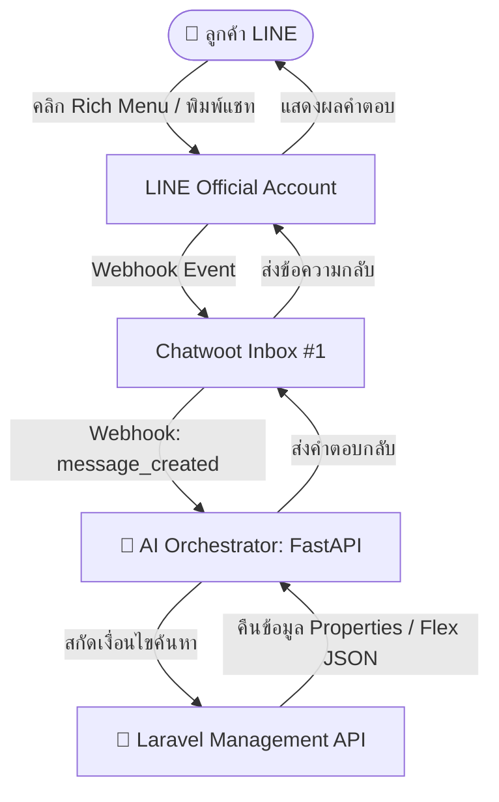

# คู่มือการติดตั้งและใช้งาน LINE Rich Menu & Flex Message (บิว Property)

เอกสารนี้รวบรวมรายละเอียด สถาปัตยกรรม คำสั่ง และการทำงานของระบบ **LINE Rich Menu** และ **LINE Flex Message API** ที่ติดตั้งและใช้งานกับระบบ **บิว Property (Bill Property)**

---

## 📑 สารบัญ
1. [ภาพรวมสถาปัตยกรรม (Architecture)](#1-ภาพรวมสถาปัตยกรรม-architecture)
2. [การตั้งค่าและการทำงานของ LINE Rich Menu](#2-การตั้งค่าและการทำงานของ-line-rich-menu)
3. [LINE Flex Message API (สำหรับอสังหาริมทรัพย์)](#3-line-flex-message-api-สำหรับอสังหาริมทรัพย์)
4. [ตัวอย่าง JSON Payload ของ Flex Message](#4-ตัวอย่าง-json-payload-ของ-flex-message)
5. [แนวทางการนำ Flex Message ไปใช้งานร่วมกับ Chatwoot / LINE](#5-แนวทางการนำ-flex-message-ไปใช้งานร่วมกับ-chatwoot--line)

---

## 1. ภาพรวมสถาปัตยกรรม (Architecture)



---

## 2. การตั้งค่าและการทำงานของ LINE Rich Menu

### 2.1 ข้อมูล Rich Menu ที่ติดตั้งแล้ว
* **Rich Menu ID:** `richmenu-9206bd5f4bf942f962ef8232391892a7`
* **สถานะ:** Active (Default Rich Menu สำหรับผู้ใช้ทุกคน)
* **ขนาดภาพ:** `2500 x 1686` px (มาตรฐานความละเอียดสูง 3:2)
* **ธีมสี:** Navy Blue (`#0F172A`) & Warm Gold (`#D97706`)

### 2.2 โครงสร้าง 6 ช่อง (2 แถว x 3 คอลัมน์)

| ช่อง | พิกัด Bounds (x, y, w, h) | ป้ายกำกับ | Action ที่ส่งกลับเมื่อกด |
|---|---|---|---|
| **1. บนซ้าย** | `(0, 0, 833, 843)` | 🏢 ค้นหาคอนโด | `"สนใจดูคอนโดครับ มีโครงการไหนแนะนำบ้าง"` |
| **2. บนกลาง** | `(833, 0, 834, 843)` | 🏡 ค้นหาบ้านเดี่ยว | `"สนใจดูบ้านเดี่ยวและทาวน์โฮมครับ"` |
| **3. บนขวา** | `(1667, 0, 833, 843)` | 📝 ฝากขาย-ฝากเช่า | `"อยากฝากขายหรือฝากเช่าอสังหาฯ ต้องทำยังไงครับ"` |
| **4. ล่างซ้าย** | `(0, 843, 833, 843)` | 💰 ปรึกษาสินเชื่อ | `"ขอคำปรึกษาเรื่องสินเชื่อบ้านและกู้ธนาคารครับ"` |
| **5. ล่างกลาง** | `(833, 843, 834, 843)` | 🕒 ข้อมูลบริการ & เวลาทำการ | `"บิว Property เปิดกี่โมง และมีบริการอะไรบ้างครับ"` |
| **6. ล่างขวา** | `(1667, 843, 833, 843)` | 👨‍💼 ติดต่อเจ้าหน้าที่ | `"ขอคุยกับเจ้าหน้าที่"` *(กระตุ้น Human Handoff)* |

### 2.3 สคริปต์ที่ใช้สร้างและเปิดใช้งาน Rich Menu (Python)

```python
import os, httpx

LINE_TOKEN = os.getenv("LINE_CHANNEL_ACCESS_TOKEN")
headers = {"Authorization": f"Bearer {LINE_TOKEN}", "Content-Type": "application/json"}

# 1. สร้างโครงสร้าง Rich Menu
rich_menu_data = {
    "size": {"width": 2500, "height": 1686},
    "selected": True,
    "name": "Bill Property Main Menu",
    "chatBarText": "เมนูหลัก",
    "areas": [
        {"bounds": {"x": 0, "y": 0, "width": 833, "height": 843}, "action": {"type": "message", "text": "สนใจดูคอนโดครับ มีโครงการไหนแนะนำบ้าง"}},
        {"bounds": {"x": 833, "y": 0, "width": 834, "height": 843}, "action": {"type": "message", "text": "สนใจดูบ้านเดี่ยวและทาวน์โฮมครับ"}},
        {"bounds": {"x": 1667, "y": 0, "width": 833, "height": 843}, "action": {"type": "message", "text": "อยากฝากขายหรือฝากเช่าอสังหาฯ ต้องทำยังไงครับ"}},
        {"bounds": {"x": 0, "y": 843, "width": 833, "height": 843}, "action": {"type": "message", "text": "ขอคำปรึกษาเรื่องสินเชื่อบ้านและกู้ธนาคารครับ"}},
        {"bounds": {"x": 833, "y": 843, "width": 834, "height": 843}, "action": {"type": "message", "text": "บิว Property เปิดกี่โมง และมีบริการอะไรบ้างครับ"}},
        {"bounds": {"x": 1667, "y": 843, "width": 833, "height": 843}, "action": {"type": "message", "text": "ขอคุยกับเจ้าหน้าที่"}}
    ]
}
res = httpx.post("https://api.line.me/v2/bot/richmenu", headers=headers, json=rich_menu_data)
rich_menu_id = res.json()["richMenuId"]

# 2. อัปโหลดภาพ Rich Menu
with open("richmenu_2500x1686.jpg", "rb") as f:
    img_bytes = f.read()
httpx.post(f"https://api-data.line.me/v2/bot/richmenu/{rich_menu_id}/content", 
           headers={"Authorization": f"Bearer {LINE_TOKEN}", "Content-Type": "image/jpeg"}, 
           content=img_bytes)

# 3. ตั้งเป็นเมนูหลักเริ่มต้น
httpx.post(f"https://api.line.me/v2/bot/user/all/richmenu/{rich_menu_id}", headers=headers)
```

---

## 3. LINE Flex Message API (สำหรับอสังหาริมทรัพย์)

เราได้สร้าง API บน Laravel Management เพื่อแปลงข้อมูลอสังหาฯ จากฐานข้อมูลออกมาเป็น **LINE Flex Message JSON** ตามมาตรฐานทางการของ LINE:

### 3.1 Endpoint สำหรับดึง Flex Message เดี่ยว (Bubble Card)
* **Method:** `GET /api/v1/flex/catalog/{package_id}`
* **Header:** `Authorization: Bearer <API_TOKEN>`
* **ผลลัพธ์:** คืนค่า JSON สำหรับแสดงการ์ดห้อง/บ้าน 1 รายการ พร้อมปุ่ม *"ดูรายละเอียด"* และ *"นัดชม/ติดต่อแอดมิน"*

### 3.2 Endpoint สำหรับดึง Flex Carousel (สไลด์หลายรายการ)
* **Method:** `GET /api/v1/flex/carousel?category_slug=condo&limit=5`
* **Header:** `Authorization: Bearer <API_TOKEN>`
* **ผลลัพธ์:** คืนค่า Flex Carousel ที่สามารถปัดเลื่อนซ้าย-ขวาดูรายการทรัพย์แนะนำได้ทันที

---

## 4. ตัวอย่าง JSON Payload ของ Flex Message

### 4.1 ตัวอย่าง Property Bubble Card (การ์ดเดี่ยว)

```json
{
  "type": "flex",
  "altText": "🏡 คอนโดตัวอย่าง บางนา 1 ห้องนอน - ฿2,600,000",
  "contents": {
    "type": "bubble",
    "size": "kilo",
    "header": {
      "type": "box",
      "layout": "vertical",
      "backgroundColor": "#0F172A",
      "paddingAll": "14px",
      "contents": [
        {
          "type": "box",
          "layout": "horizontal",
          "contents": [
            { "type": "text", "text": "คอนโดมิเนียม", "color": "#94A3B8", "size": "xs", "weight": "bold", "flex": 1 },
            { "type": "text", "text": "สำหรับขาย", "color": "#FFFFFF", "size": "xxs", "backgroundColor": "#D97706", "cornerRadius": "4px", "paddingStart": "6px", "paddingEnd": "6px" }
          ]
        },
        { "type": "text", "text": "บางนา เรสซิเดนซ์ (ตัวอย่าง)", "color": "#FFFFFF", "size": "md", "weight": "bold", "margin": "sm" }
      ]
    },
    "body": {
      "type": "box",
      "layout": "vertical",
      "spacing": "md",
      "paddingAll": "16px",
      "contents": [
        { "type": "text", "text": "฿2,600,000", "size": "xl", "weight": "bold", "color": "#D97706" },
        { "type": "text", "text": "📍 บางนา กรุงเทพมหานคร", "size": "xs", "color": "#64748B" },
        { "type": "text", "text": "🛏️ 1 นอน  |  🚿 1 น้ำ  |  📐 32 ตร.ม.", "size": "xs", "color": "#334155", "weight": "bold" }
      ]
    },
    "footer": {
      "type": "box",
      "layout": "vertical",
      "spacing": "sm",
      "paddingAll": "12px",
      "contents": [
        {
          "type": "button",
          "style": "primary",
          "color": "#0F172A",
          "height": "sm",
          "action": {
            "type": "message",
            "label": "ดูรายละเอียดตัวนี้",
            "text": "ขอดูรายละเอียด คอนโดตัวอย่าง บางนา 1 ห้องนอน (รหัส DEMO-CONDO-005) ครับ"
          }
        },
        {
          "type": "button",
          "style": "secondary",
          "height": "sm",
          "action": {
            "type": "message",
            "label": "นัดชม / ติดต่อแอดมิน",
            "text": "สนใจนัดชมห้อง คอนโดตัวอย่าง บางนา 1 ห้องนอน ขอคุยกับเจ้าหน้าที่ครับ"
          }
        }
      ]
    }
  }
}
```

---

## 5. แนวทางการนำ Flex Message ไปใช้งานร่วมกับ Chatwoot / LINE

### ปัจจุบัน:
* **Chatwoot Community Edition (CE)** ส่งข้อความตอบกลับไปยัง LINE ในรูปแบบ **Text / Markdown**
* **AI Orchestrator** สรุปข้อมูลรายการอสังหาฯ และตอบกลับเป็นข้อความสนทนาที่อ่านง่ายและเป็นธรรมชาติ

### การต่อยอดส่ง Flex Card ตรงเข้า LINE:
หากต้องการให้บอทส่ง **Flex Carousel Card แบบกราฟิกเต็มรูปแบบ** เข้าห้องแชท LINE สามารถทำได้โดย:
1. **ยิง LINE Push Message API โดยตรง:** ใช้ `LINE_CHANNEL_ACCESS_TOKEN` ส่ง Flex JSON เข้า `POST https://api.line.me/v2/bot/message/push` หรือ `reply` โดยส่งคู่ขนานไปพร้อมกับข้อความ AI
2. **เรียกใช้จาก API ของเรา:** ดึง Flex JSON ผ่าน endpoint `GET /api/v1/flex/carousel?category_slug=condo` แล้วส่งเข้า LINE Messaging API ได้ทันที
