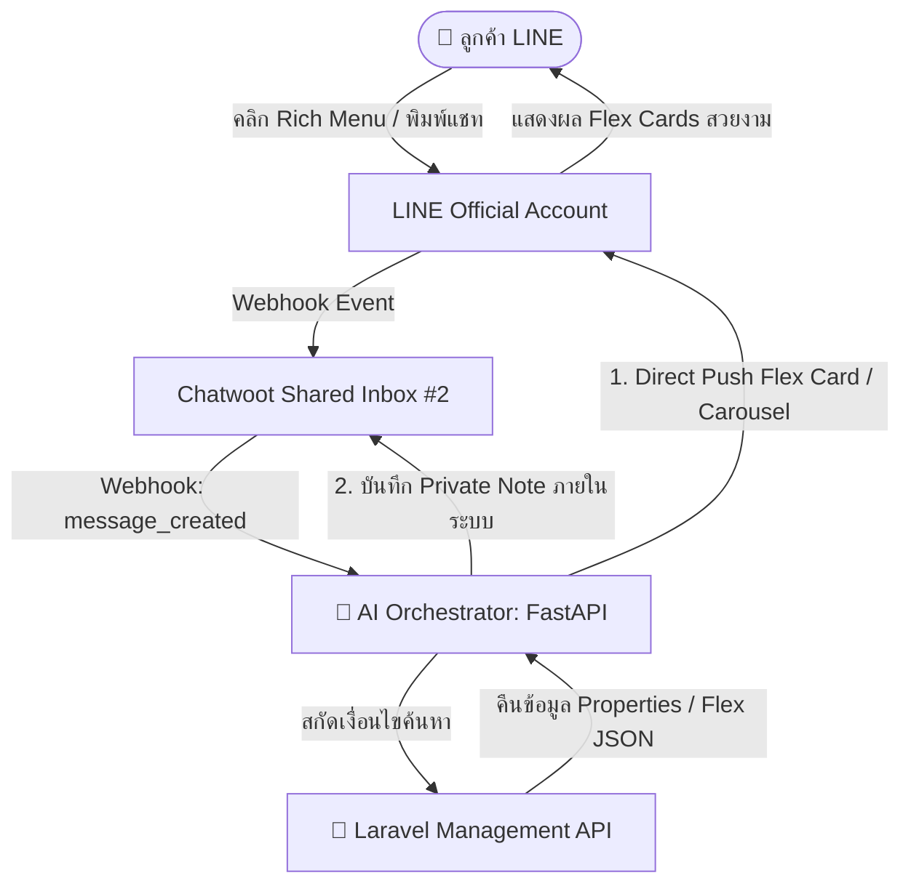

# คู่มือการติดตั้งและใช้งาน LINE Rich Menu & Flex Message (บิว Property)

เอกสารนี้รวบรวมรายละเอียด สถาปัตยกรรม คำสั่ง และการทำงานของระบบ **LINE Rich Menu**, **LINE Flex Message API**, และ **กฎการตั้งค่า Inbox บน Chatwoot** ที่ติดตั้งและใช้งานกับระบบ **บิว Property (Bill Property)**

---

## 📑 สารบัญ
1. [ภาพรวมสถาปัตยกรรม (Architecture)](#1-ภาพรวมสถาปัตยกรรม-architecture)
2. [การตั้งค่าและการทำงานของ LINE Rich Menu (English Default)](#2-การตั้งค่าและการทำงานของ-line-rich-menu)
3. [LINE Flex Message API (สำหรับอสังหาริมทรัพย์และบริการ)](#3-line-flex-message-api-สำหรับอสังหาริมทรัพย์)
4. [ตัวอย่าง JSON Payload ของ Flex Message](#4-ตัวอย่าง-json-payload-ของ-flex-message)
5. [กฎสำคัญในการตั้งค่า Chatwoot Inbox & Session (Critical Configuration)](#5-กฎสำคัญในการตั้งค่า-chatwoot-inbox--session-critical-configuration)
6. [แนวทางการนำ Flex Message ไปใช้งานร่วมกับ Chatwoot / LINE](#6-แนวทางการนำ-flex-message-ไปใช้งานร่วมกับ-chatwoot--line)

---

## 1. ภาพรวมสถาปัตยกรรม (Architecture)



---

## 2. การตั้งค่าและการทำงานของ LINE Rich Menu

### 2.1 ข้อมูล Rich Menu ภาษาอังกฤษ (Active Default)
* **Rich Menu ID:** `richmenu-d94d0c6567f749f064db55560fea2b32`
* **สถานะ:** Active (Default Rich Menu สำหรับผู้ใช้ทุกคน)
* **ขนาดภาพ:** `2500 x 1686` px (มาตรฐานความละเอียดสูง 3:2)
* **ธีมสี:** Luxury Navy Blue (`#0F172A`) & Warm Gold (`#D97706`)
* **Chat Bar Text:** `Menu`

### 2.2 โครงสร้าง 6 ช่อง (2 แถว x 3 คอลัมน์)

| ช่อง | พิกัด Bounds (x, y, w, h) | ป้ายกำกับบนการ์ด | Action Text ที่ส่ง | ผลลัพธ์ที่ตอบกลับ |
|---|---|---|---|---|
| **1. บนซ้าย** | `(0, 0, 833, 843)` | 🏢 SEARCH CONDOS | `"Search Condos"` | 🎴 Flex Carousel คอนโด |
| **2. บนกลาง** | `(833, 0, 834, 843)` | 🏡 SEARCH HOUSES | `"Search Houses"` | 🎴 Flex Carousel บ้าน |
| **3. บนขวา** | `(1667, 0, 833, 843)` | 📝 CONSIGNMENT | `"Property consignment services (sell or rent)"` | 🎴 Flex Card รับฝากขาย-เช่า |
| **4. ล่างซ้าย** | `(0, 843, 833, 843)` | 💰 HOME LOAN | `"Home loan and mortgage consultation"` | 🎴 Flex Card สินเชื่อบ้าน |
| **5. ล่างกลาง** | `(833, 843, 834, 843)` | 🕒 ABOUT & HOURS | `"What are your business services and opening hours?"` | 🎴 Flex Card ข้อมูล & เวลาทำการ |
| **6. ล่างขวา** | `(1667, 843, 833, 843)` | 👨‍💼 CONTACT AGENT | `"Talk to human agent"` | 👨‍💼 ส่งต่อให้เจ้าหน้าที่ (Handoff) |

### 2.3 สคริปต์ที่ใช้สร้างและเปิดใช้งาน Rich Menu (Python)

```python
import os, httpx

LINE_TOKEN = os.getenv("LINE_CHANNEL_ACCESS_TOKEN")
headers = {"Authorization": f"Bearer {LINE_TOKEN}", "Content-Type": "application/json"}

# 1. สร้างโครงสร้าง Rich Menu
rich_menu_data = {
    "size": {"width": 2500, "height": 1686},
    "selected": True,
    "name": "Bill Property Main Menu",
    "chatBarText": "เมนูหลัก",
    "areas": [
        {"bounds": {"x": 0, "y": 0, "width": 833, "height": 843}, "action": {"type": "message", "text": "สนใจดูคอนโดครับ มีโครงการไหนแนะนำบ้าง"}},
        {"bounds": {"x": 833, "y": 0, "width": 834, "height": 843}, "action": {"type": "message", "text": "สนใจดูบ้านเดี่ยวและทาวน์โฮมครับ"}},
        {"bounds": {"x": 1667, "y": 0, "width": 833, "height": 843}, "action": {"type": "message", "text": "อยากฝากขายหรือฝากเช่าอสังหาฯ ต้องทำยังไงครับ"}},
        {"bounds": {"x": 0, "y": 843, "width": 833, "height": 843}, "action": {"type": "message", "text": "ขอคำปรึกษาเรื่องสินเชื่อบ้านและกู้ธนาคารครับ"}},
        {"bounds": {"x": 833, "y": 843, "width": 834, "height": 843}, "action": {"type": "message", "text": "บิว Property เปิดกี่โมง และมีบริการอะไรบ้างครับ"}},
        {"bounds": {"x": 1667, "y": 843, "width": 833, "height": 843}, "action": {"type": "message", "text": "ขอคุยกับเจ้าหน้าที่"}}
    ]
}
res = httpx.post("https://api.line.me/v2/bot/richmenu", headers=headers, json=rich_menu_data)
rich_menu_id = res.json()["richMenuId"]

# 2. อัปโหลดภาพ Rich Menu
with open("richmenu_2500x1686.jpg", "rb") as f:
    img_bytes = f.read()
httpx.post(f"https://api-data.line.me/v2/bot/richmenu/{rich_menu_id}/content", 
           headers={"Authorization": f"Bearer {LINE_TOKEN}", "Content-Type": "image/jpeg"}, 
           content=img_bytes)

# 3. ตั้งเป็นเมนูหลักเริ่มต้น
httpx.post(f"https://api.line.me/v2/bot/user/all/richmenu/{rich_menu_id}", headers=headers)
```

---

## 3. LINE Flex Message API (สำหรับอสังหาริมทรัพย์)

เราได้สร้าง API บน Laravel Management เพื่อแปลงข้อมูลอสังหาฯ จากฐานข้อมูลออกมาเป็น **LINE Flex Message JSON** ตามมาตรฐานทางการของ LINE:

### 3.1 Endpoint สำหรับดึง Flex Message เดี่ยว (Bubble Card)
* **Method:** `GET /api/v1/flex/catalog/{package_id}`
* **Header:** `Authorization: Bearer <API_TOKEN>`
* **ผลลัพธ์:** คืนค่า JSON สำหรับแสดงการ์ดห้อง/บ้าน 1 รายการ พร้อมปุ่ม *"ดูรายละเอียด"* และ *"นัดชม/ติดต่อแอดมิน"*

### 3.2 Endpoint สำหรับดึง Flex Carousel (สไลด์หลายรายการ)
* **Method:** `GET /api/v1/flex/carousel?category_slug=condo&limit=5`
* **Header:** `Authorization: Bearer <API_TOKEN>`
* **ผลลัพธ์:** คืนค่า Flex Carousel ที่สามารถปัดเลื่อนซ้าย-ขวาดูรายการทรัพย์แนะนำได้ทันที

---

## 4. ตัวอย่าง JSON Payload ของ Flex Message

### 4.1 ตัวอย่าง Property Bubble Card (การ์ดเดี่ยว)

```json
{
  "type": "flex",
  "altText": "🏡 คอนโดตัวอย่าง บางนา 1 ห้องนอน - ฿2,600,000",
  "contents": {
    "type": "bubble",
    "size": "kilo",
    "header": {
      "type": "box",
      "layout": "vertical",
      "backgroundColor": "#0F172A",
      "paddingAll": "14px",
      "contents": [
        {
          "type": "box",
          "layout": "horizontal",
          "contents": [
            { "type": "text", "text": "คอนโดมิเนียม", "color": "#94A3B8", "size": "xs", "weight": "bold", "flex": 1 },
            { "type": "text", "text": "สำหรับขาย", "color": "#FFFFFF", "size": "xxs", "backgroundColor": "#D97706", "cornerRadius": "4px", "paddingStart": "6px", "paddingEnd": "6px" }
          ]
        },
        { "type": "text", "text": "บางนา เรสซิเดนซ์ (ตัวอย่าง)", "color": "#FFFFFF", "size": "md", "weight": "bold", "margin": "sm" }
      ]
    },
    "body": {
      "type": "box",
      "layout": "vertical",
      "spacing": "md",
      "paddingAll": "16px",
      "contents": [
        { "type": "text", "text": "฿2,600,000", "size": "xl", "weight": "bold", "color": "#D97706" },
        { "type": "text", "text": "📍 บางนา กรุงเทพมหานคร", "size": "xs", "color": "#64748B" },
        { "type": "text", "text": "🛏️ 1 นอน  |  🚿 1 น้ำ  |  📐 32 ตร.ม.", "size": "xs", "color": "#334155", "weight": "bold" }
      ]
    },
    "footer": {
      "type": "box",
      "layout": "vertical",
      "spacing": "sm",
      "paddingAll": "12px",
      "contents": [
        {
          "type": "button",
          "style": "primary",
          "color": "#0F172A",
          "height": "sm",
          "action": {
            "type": "message",
            "label": "ดูรายละเอียดตัวนี้",
            "text": "ขอดูรายละเอียด คอนโดตัวอย่าง บางนา 1 ห้องนอน (รหัส DEMO-CONDO-005) ครับ"
          }
        },
        {
          "type": "button",
          "style": "secondary",
          "height": "sm",
          "action": {
            "type": "message",
            "label": "นัดชม / ติดต่อแอดมิน",
            "text": "สนใจนัดชมห้อง คอนโดตัวอย่าง บางนา 1 ห้องนอน ขอคุยกับเจ้าหน้าที่ครับ"
          }
        }
      ]
    }
  }
}
```

---

## 5. กฎสำคัญในการตั้งค่า Chatwoot Inbox & Session (Critical Configuration)

เพื่อป้องกันปัญหาแชทสูญหาย แชทถูกซ่อน หรือผู้ดูแลระบบบางท่านมองไม่เห็นแชทของลูกค้า ต้องปฏิบัติตามกฎการตั้งค่าดังนี้อย่างเคร่งครัด:

### 5.1 ปิดระบบ Auto-Assignment บน Inbox กลาง (`enable_auto_assignment = false`)
* **สาเหตุ:** หากเปิด `enable_auto_assignment: true` ระบบของ Chatwoot จะสุ่มดึงแชทที่เข้ามาใหม่ไปมอบหมาย (`assignee_id`) ให้กับเจ้าหน้าที่คนใดคนหนึ่งทันที ทำให้เจ้าหน้าที่ท่านอื่นที่ล็อกอินเข้ามาแล้วดูแท็บเริ่มต้น **"Mine" (เฉพาะงานของฉัน)** มองไม่เห็นแชทของลูกค้ารายนั้น
* **การตั้งค่าที่ถูกต้อง:**
  * กำหนด `inbox.enable_auto_assignment = false` สำหรับ LINE Inbox (Inbox #2)
  * แชทที่เข้ามาใหม่และแชทที่ AI กำลังพูดคุย จะอยู่ในสถานะ **`Open`** และ **`Unassigned` (กองกลาง)** เสมอ
  * เจ้าหน้าที่และแอดมินทุกคนในระบบจะสามารถมองเห็นแชทของลูกค้าทุกคนแบบ Real-time พร้อมกัน 100% ในแท็บ **"Unassigned"** และ **"All"**

### 5.2 สถานะ Session และการแสดงผลแชท
* **ห้าม Auto-Resolve แชทที่ยังสนทนาอยู่:** แชทที่ AI กำลังคุยต้องมีสถานะเป็น `status = 0 (Open)` เสมอ
* **เมื่อส่ง Flex Card ตรงเข้า LINE:**
  * ระบบ AI Worker จะส่งเฉพาะ Flex Card / Carousel ไปยัง LINE ของลูกค้าโดยตรงผ่าน LINE Push API
  * AI Worker จะบันทึกคำแนะนำและการตอบกลับลงใน Chatwoot ในรูปแบบ **Private Note (`private = true`)** เพื่อให้แอดมินในทีมดูประวัติย้อนหลังได้ แต่จะไม่ส่งข้อความ Text ซ้ำซ้อนไปยัง LINE ของลูกค้า
* **การส่งต่อให้เจ้าหน้าที่ (Human Handoff):**
  * เมื่อลูกค้าพิมพ์ขอคุยกับคน (`"ขอคุยกับเจ้าหน้าที่"`, `"Talk to human agent"`)
  * AI Worker จะเปลี่ยน `ai_mode = "human"`, ติดป้าย Label `human-handling` และส่งเรื่องเข้าทีมเจ้าหน้าที่ (Team Assignment)
  * เจ้าหน้าที่สามารถกดรับเคส (Assign to me) เพื่อพูดคุยกับลูกค้าได้ทันที
* **การส่งแชทคืนให้ AI (Return to AI):**
  * เมื่อเจ้าหน้าที่ดูแลลูกค้าเสร็จสิ้น ให้ติดป้าย Label `return-to-ai`
  * ระบบจะปลดป้าย `human-handling`, ล้าง `assignee_id = NULL` และรีเซ็ต `ai_mode = "ai"` เพื่อให้บอทกลับมาดูแลต่ออัตโนมัติ

---

## 6. แนวทางการแก้ไขปัญหาเมื่อแชทไม่แสดง (Troubleshooting Checklist)

หากเจ้าหน้าที่ล็อกอินเข้า Chatwoot แล้วไม่เห็นแชทลูกค้า ให้ตรวจสอบตามขั้นตอนดังนี้:
1. **ตรวจสอบตัวกรองแท็บ (Tab Filter):** ให้เปลี่ยนจากแท็บ **"Mine"** ไปที่แท็บ **"Unassigned" (รอรับเรื่อง)** หรือ **"All" (ทั้งหมด)**
2. **ตรวจสอบตัวกรองสถานะ (Status Filter):** ตรวจสอบว่าตัวกรองตั้งอยู่ที่ **"Open"** (หากแชทเคยถูกกด Resolve ให้ตรวจสอบในแท็บ "Resolved" หรือ "All")
3. **ตรวจสอบสมาชิก Inbox (Inbox Members):** ผู้ใช้ทุกคนต้องถูกเพิ่มเป็นสมาชิกของ `LINE Business` Inbox (`inbox_id = 2`)
4. **ตรวจสอบการตั้งค่า Auto-Assign ในฐานข้อมูล:**
   ```sql
   UPDATE inboxes SET enable_auto_assignment = false WHERE id = 2;
   ```

